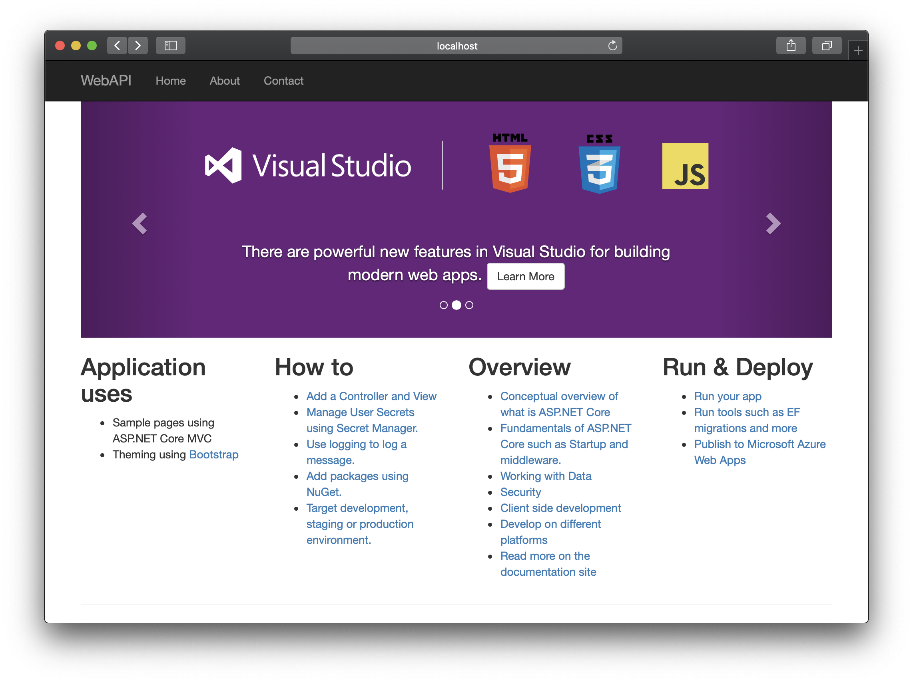
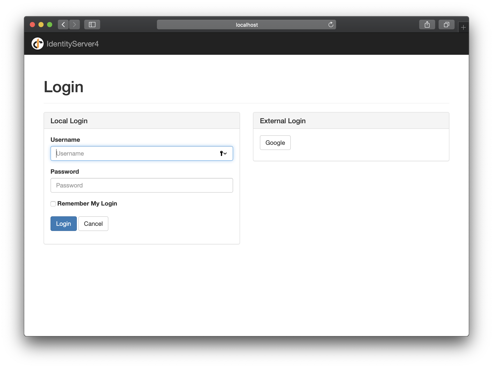
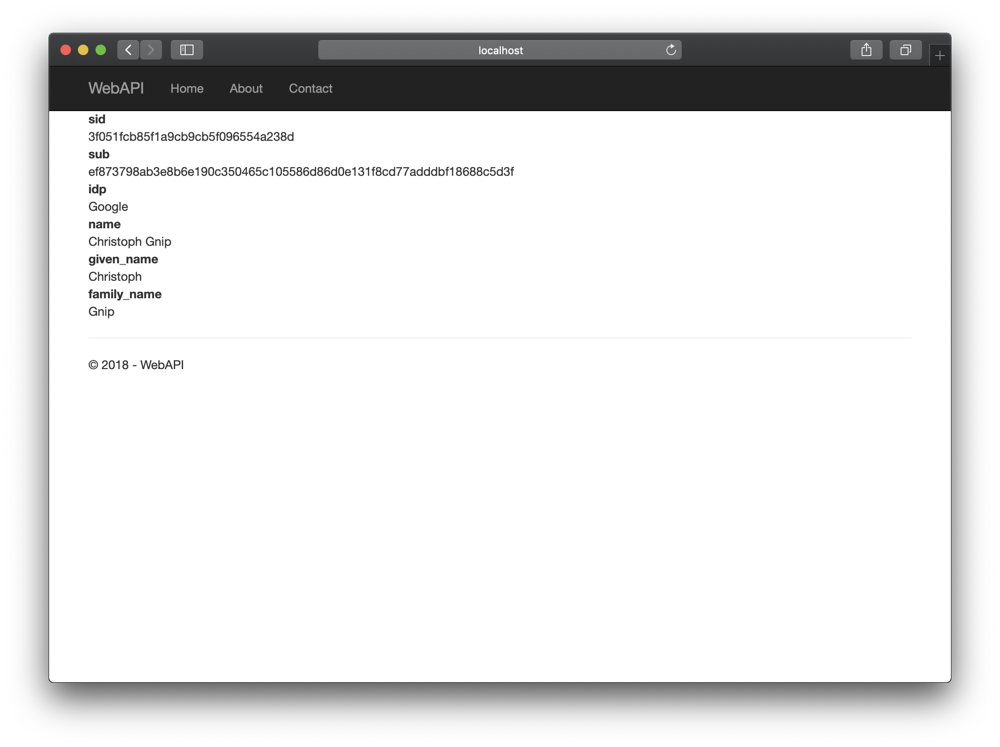
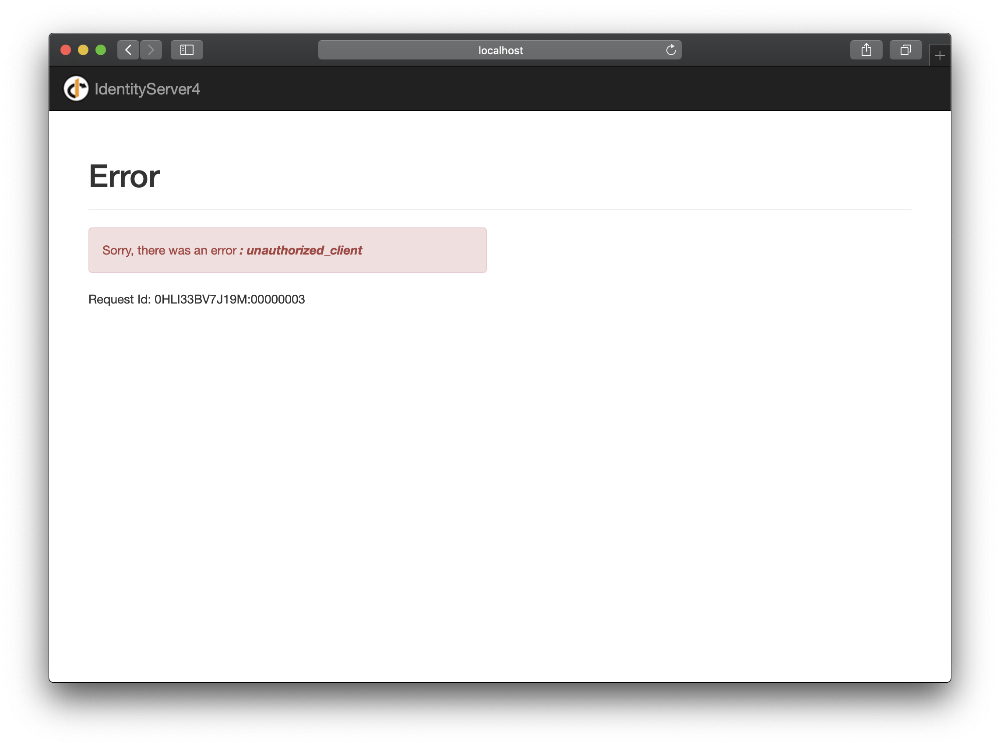

# IdentityServer 4 Workshop

This repository contains:

1. an IdentityServer 4 setup and
1. a MVC ASP.NET Core WebApp

to demonstrate the usage and capabilities of the IdentityServer 4.

The goal is to understand the workings of the IdentityServer 4 framework and get
to known the basic interactions between a web application and OAuth2/OpenID as
Authentication/Authorization mechanism.

## TL;DR

1. Check out the master branch:

   `git checkout master`

1. Open two terminal windows.
1. Open a browser with two tabs.
1. Start IdentityServer 4 in the first one:

   `cd IdentityServer && dotnet run`

1. Start MVC WebApp

   `cd WebAPI && dotnet run`

1. In the Browser navigate to

   1. `localhost:5000` - for the IdentityServer
   1. `localhost:5002` - for the WebAPP

1. You will find the secured route under:

   `http://localhost:5002/Home/About`

   Visiting will lead you to the IdentityServer login page.

## Long Version

This repository contains different Git-Tags that will illustrate the
interactions between:

1. an IdentityServer 4, which will hand-out Access Token, and
1. a MVC WebApp, that will be secured by the Access Token.

You will find several Git-Tags, that you can follow along step-by-step; the
first can be found with:

`git checkout Step1_IDServer_Base_Setup`

the last is:

`git checkout Demo_Complete`

To run this demo navigate the IdentityServer 4 folder; start the
IdentityServer 4:

`dotnet run`

This should result in:

```plain
Using launch settings from (...)IdentityServer4_Workshops/IdentityServer/Properties/launchSettings.json...
[11:55:20 Information] IdentityServer4.Startup
You are using the in-memory version of the persisted grant store. This will store consent decisions, authorization codes, refresh and reference tokens in memory only. If you are using any of those features in production, you want to switch to a different store implementation.

[11:55:20 Debug] IdentityServer4.Startup
Using idsrv as default scheme for authentication

[11:55:20 Debug] IdentityServer4.Startup
Using idsrv as default scheme for sign-in

[11:55:20 Debug] IdentityServer4.Startup
Using idsrv as default scheme for sign-out

[11:55:20 Debug] IdentityServer4.Startup
Using idsrv as default scheme for challenge

[11:55:20 Debug] IdentityServer4.Startup
Using idsrv as default scheme for forbid

Hosting environment: Development
Content root path: (...)IdentityServer4_Workshops/IdentityServer
Now listening on: http://localhost:5000
Application started. Press Ctrl+C to shut down.
```

The important part is `http://localhost:5000`.

If you follow the Git-Tags you can-- beginning at Step2_WebAPI_Base_Setup--
start the WebAPI like this:

`dotnet run`

This should result in:

```
Using launch settings from (...)IdentityServer4_Workshops/WebAPI/Properties/launchSettings.json...
info: Microsoft.AspNetCore.DataProtection.KeyManagement.XmlKeyManager[0]
      User profile is available. Using '(...).aspnet/DataProtection-Keys' as key repository; keys will not be encrypted at rest.
Hosting environment: Development
Content root path: (...)IdentityServer4_Workshops/WebAPI
Now listening on: http://localhost:5002
Application started. Press Ctrl+C to shut down.
```

The important part is `http://localhost:5002`; HTTPS is deliberately turned-off
for this demo; the two projects are using simple dotnet templates for the
[dotnet new command](https://docs.microsoft.com/de-de/dotnet/core/tools/dotnet-new?tabs=netcore21).

Visiting the welcome page, should give you this welcome screen of the MVC Web
App:



## Users in this Demo

Starting from step 5 (Git-Tag: Step5_Add_Users_Client_and_Ressource) you will
be able to login over the IdentityServer; the following users are configured:

1. Alice
1. Bob

Both use the string "password" as password; this is an extract from the user
configuration:

```cs
{
    SubjectId = "1",
    Username = "alice",
    Password = "password",

    Claims = new []
    {
        (...)
    }
},
{
    SubjectId = "2",
    Username = "bob",
    Password = "password",

    Claims = new []
    {
        (...)
    }
}
```

## Login

If you are not logged in, you can navigate to the route:

`http://localhost:5002/Home/About`

you can use on of the users above or, starting by Git-Tag:
Step7_Add_Google_External_Provider, you can use Google as External source.

The login page should look something like this:



depending on the workshop-step you are currently viewing, the layout can be
different and the external login could be missing.

## Logout

If you are logged in, you can navigate to the route:

`http://localhost:5002/Home/Logout`

to trigger the logout mechanism of the IdentityServer.

## Authentication Test Page

The Demo includes a page to view the claims corresponding to an access token;
you can view the page at:

`http://localhost:5002/Home/AuthTest`

The Page will present you with something like this:



## Play Around

If you are at the tag Demo_Complete, you have all what it takes to understand the workings.

By playing around it will probably appear the following view:



This is in our experience on of the most common scenarios; it comes from a
simple misconfiguration of the IdentityServer and the Web App.

To solve this, check the log output of the IdentityServer, this is usually a
good help; those types of errors can have multiple causes and are difficult to
list here; please feel invited to contact us.

## Contact Information


